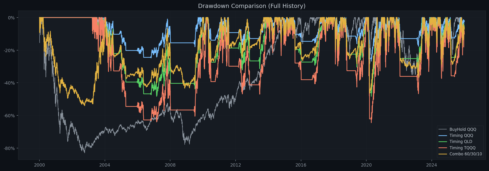
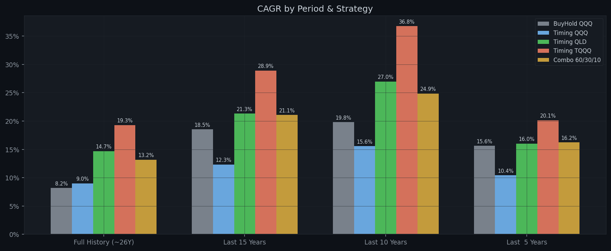
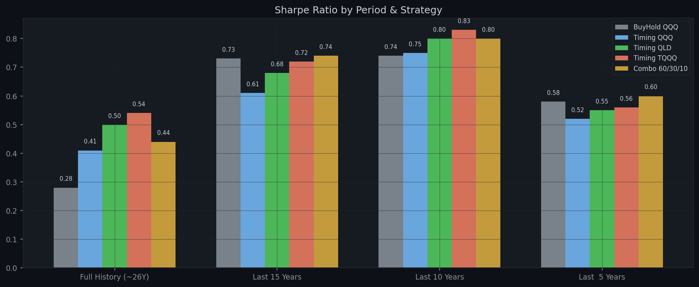

# Multi-Strategy MA200 Backtest Report

**Generated:** 2026-04-18  
**Parameters:** Buy `×1.04` | Sell `×0.97` | MA `200` | Tranches `3` | Dip `-1.0%` | Capital `$100,000`  
**Combo allocation:** QQQ 60% / QLD 30% / TQQQ 10%

---

## Performance Summary / 分周期回测结果

### Full History (~26Y)

| Strategy | Total Return | Final Value | CAGR | Max DD | Sharpe | In Market |
|---|---:|---:|---:|---:|---:|---:|
| **BuyHold QQQ** | +674.01% | $774,014 | +8.19% | -82.96% | 0.28 | 100.0% |
| **Timing QQQ** | +840.69% | $940,690 | +9.01% | -26.76% | 0.41 | 60.6% |
| **Timing QLD** | +3428.06% | $3,528,061 | +14.69% | -48.32% | 0.50 | 60.6% |
| **Timing TQQQ** | +9702.87% | $9,802,873 | +19.29% | -64.46% | 0.54 | 60.6% |
| **Combo 60/30/10** | +2403.11% | $2,503,114 | +13.19% | -54.00% | 0.44 | 60.6% |

### Last 15 Years

| Strategy | Total Return | Final Value | CAGR | Max DD | Sharpe | In Market |
|---|---:|---:|---:|---:|---:|---:|
| **BuyHold QQQ** | +1176.81% | $1,276,808 | +18.52% | -35.12% | 0.73 | 100.0% |
| **Timing QQQ** | +471.97% | $571,970 | +12.34% | -26.76% | 0.61 | 70.2% |
| **Timing QLD** | +1709.47% | $1,809,468 | +21.31% | -48.28% | 0.68 | 70.2% |
| **Timing TQQQ** | +4399.42% | $4,499,421 | +28.91% | -64.46% | 0.72 | 70.2% |
| **Combo 60/30/10** | +1658.87% | $1,758,867 | +21.08% | -39.43% | 0.74 | 70.2% |

### Last 10 Years

| Strategy | Total Return | Final Value | CAGR | Max DD | Sharpe | In Market |
|---|---:|---:|---:|---:|---:|---:|
| **BuyHold QQQ** | +508.21% | $608,205 | +19.81% | -35.12% | 0.74 | 100.0% |
| **Timing QQQ** | +323.99% | $423,990 | +15.56% | -26.76% | 0.75 | 72.8% |
| **Timing QLD** | +987.47% | $1,087,471 | +26.99% | -48.28% | 0.80 | 72.8% |
| **Timing TQQQ** | +2178.92% | $2,278,918 | +36.75% | -64.46% | 0.83 | 72.8% |
| **Combo 60/30/10** | +819.06% | $919,056 | +24.87% | -40.11% | 0.80 | 72.8% |

### Last  5 Years

| Strategy | Total Return | Final Value | CAGR | Max DD | Sharpe | In Market |
|---|---:|---:|---:|---:|---:|---:|
| **BuyHold QQQ** | +106.36% | $206,364 | +15.64% | -35.12% | 0.58 | 100.0% |
| **Timing QQQ** | +63.98% | $163,979 | +10.43% | -17.60% | 0.52 | 58.0% |
| **Timing QLD** | +109.86% | $209,855 | +16.03% | -32.98% | 0.55 | 58.0% |
| **Timing TQQQ** | +149.73% | $249,731 | +20.15% | -45.56% | 0.56 | 58.0% |
| **Combo 60/30/10** | +111.75% | $211,748 | +16.24% | -32.34% | 0.60 | 58.0% |

---

## Annual Returns (Full History) / 逐年收益

| Year | BuyHold QQQ | Timing QQQ | Timing QLD | Timing TQQQ | Combo 60/30/10 |
|---|---:|---:|---:|---:|---:|
| 2000 | -38.4% | 0.0% | 0.0% | 0.0% | -23.0% |
| 2001 | -33.3% | 0.0% | 0.0% | 0.0% | -16.0% |
| 2002 | -37.4% | 0.0% | 0.0% | 0.0% | -14.2% |
| 2003 | +49.7% | +39.8% | +82.8% | +133.4% | +82.7% |
| 2004 | +10.5% | -3.2% | -9.8% | -16.4% | -6.7% |
| 2005 | +1.6% | -13.2% | -25.9% | -36.8% | -20.7% |
| 2006 | +7.1% | -2.4% | -7.8% | -11.8% | -3.3% |
| 2007 | +19.0% | +19.0% | +29.0% | +44.1% | +27.5% |
| 2008 | -41.7% | -8.5% | -16.3% | -24.0% | -26.7% |
| 2009 | +54.7% | +29.0% | +63.3% | +99.1% | +67.1% |
| 2010 | +20.1% | +2.2% | +0.9% | -1.9% | +5.4% |
| 2011 | +3.5% | -0.3% | -2.7% | -6.3% | -1.5% |
| 2012 | +18.1% | -4.0% | -9.7% | -16.3% | -2.1% |
| 2013 | +36.6% | +22.8% | +48.8% | +79.5% | +49.0% |
| 2014 | +19.2% | +19.2% | +37.6% | +57.1% | +34.9% |
| 2015 | +9.4% | -1.1% | -4.3% | -8.1% | -0.9% |
| 2016 | +7.1% | -1.8% | -3.8% | -6.0% | -0.5% |
| 2017 | +32.7% | +32.7% | +70.3% | +118.1% | +65.8% |
| 2018 | -0.1% | +6.6% | +7.5% | +5.7% | +4.8% |
| 2019 | +39.0% | +15.6% | +29.4% | +43.1% | +35.6% |
| 2020 | +48.4% | +24.1% | +40.4% | +48.9% | +45.0% |
| 2021 | +27.4% | +27.4% | +54.7% | +83.0% | +54.6% |
| 2022 | -32.6% | -11.7% | -22.3% | -31.9% | -28.0% |
| 2023 | +54.9% | +35.2% | +68.7% | +105.9% | +77.2% |
| 2024 | +25.6% | +25.6% | +42.8% | +58.3% | +45.0% |
| 2025 | +21.8% | +8.1% | +10.4% | +10.8% | +12.5% |

---

## Charts / 图表

### NAV Comparison (Log Scale) / 净值曲线对比（对数坐标）

### Drawdown Comparison / 回撤对比

### Annual Returns by Strategy / 逐年收益柱状图

### CAGR by Period / 各时间段年化收益

### Sharpe by Period / 各时间段夏普比率

