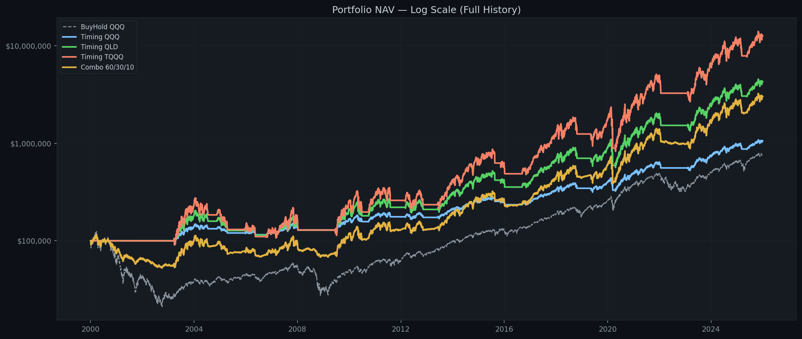
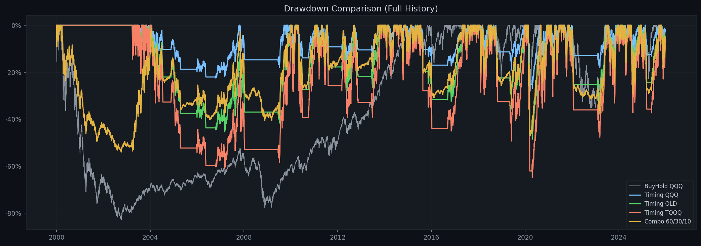
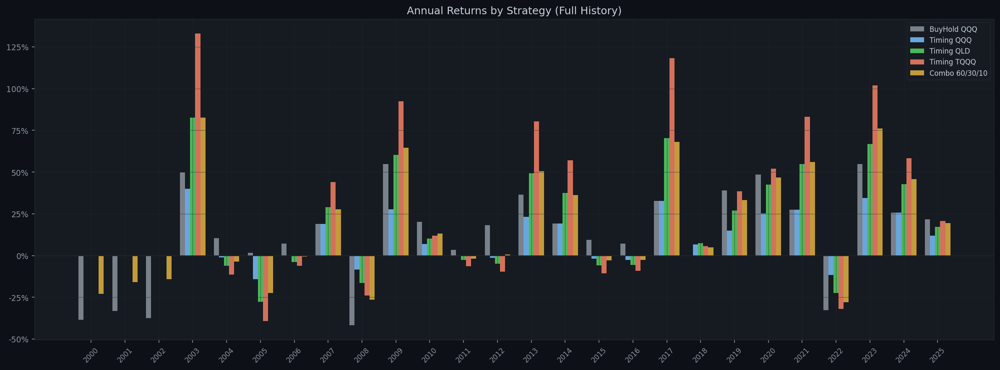
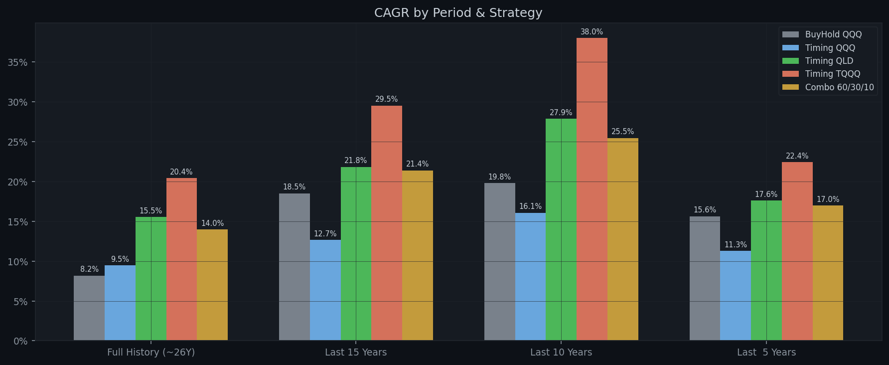
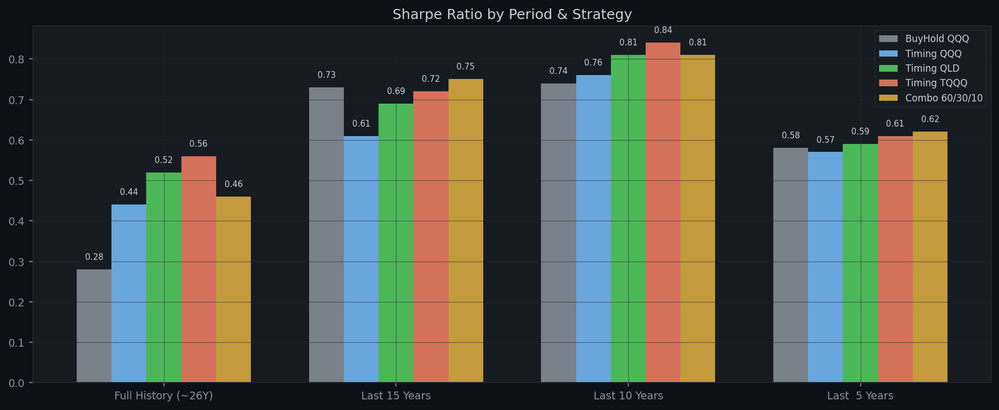

# Multi-Strategy MA200 Backtest Report

**Generated:** 2026-04-18  
**Parameters:** Buy `×1.04` | Sell `×0.97` | MA `200` | Tranches `1` | Dip `-1.0%` | Capital `$100,000`  
**Combo allocation:** QQQ 60% / QLD 30% / TQQQ 10%

---

## Performance Summary / 分周期回测结果

### Full History (~26Y)

| Strategy | Total Return | Final Value | CAGR | Max DD | Sharpe | In Market |
|---|---:|---:|---:|---:|---:|---:|
| **BuyHold QQQ** | +674.01% | $774,014 | +8.19% | -82.96% | 0.28 | 100.0% |
| **Timing QQQ** | +955.10% | $1,055,104 | +9.49% | -26.94% | 0.44 | 60.6% |
| **Timing QLD** | +4157.01% | $4,257,011 | +15.53% | -48.60% | 0.52 | 60.6% |
| **Timing TQQQ** | +12475.62% | $12,575,618 | +20.44% | -64.83% | 0.56 | 60.6% |
| **Combo 60/30/10** | +2899.07% | $2,999,074 | +13.98% | -54.00% | 0.46 | 60.6% |

### Last 15 Years

| Strategy | Total Return | Final Value | CAGR | Max DD | Sharpe | In Market |
|---|---:|---:|---:|---:|---:|---:|
| **BuyHold QQQ** | +1176.81% | $1,276,808 | +18.52% | -35.12% | 0.73 | 100.0% |
| **Timing QQQ** | +498.52% | $598,520 | +12.68% | -26.94% | 0.61 | 70.2% |
| **Timing QLD** | +1829.62% | $1,929,617 | +21.83% | -48.60% | 0.69 | 70.2% |
| **Timing TQQQ** | +4741.57% | $4,841,566 | +29.54% | -64.83% | 0.72 | 70.2% |
| **Combo 60/30/10** | +1729.13% | $1,829,127 | +21.40% | -39.38% | 0.75 | 70.2% |

### Last 10 Years

| Strategy | Total Return | Final Value | CAGR | Max DD | Sharpe | In Market |
|---|---:|---:|---:|---:|---:|---:|
| **BuyHold QQQ** | +508.21% | $608,205 | +19.81% | -35.12% | 0.74 | 100.0% |
| **Timing QQQ** | +342.98% | $442,978 | +16.07% | -26.94% | 0.76 | 72.8% |
| **Timing QLD** | +1066.96% | $1,166,961 | +27.89% | -48.60% | 0.81 | 72.8% |
| **Timing TQQQ** | +2395.39% | $2,495,391 | +38.00% | -64.83% | 0.84 | 72.8% |
| **Combo 60/30/10** | +864.55% | $964,550 | +25.47% | -40.14% | 0.81 | 72.8% |

### Last  5 Years

| Strategy | Total Return | Final Value | CAGR | Max DD | Sharpe | In Market |
|---|---:|---:|---:|---:|---:|---:|
| **BuyHold QQQ** | +106.36% | $206,364 | +15.64% | -35.12% | 0.58 | 100.0% |
| **Timing QQQ** | +70.46% | $170,457 | +11.29% | -18.02% | 0.57 | 58.0% |
| **Timing QLD** | +124.38% | $224,380 | +17.60% | -34.32% | 0.59 | 58.0% |
| **Timing TQQQ** | +174.35% | $274,353 | +22.44% | -47.75% | 0.61 | 58.0% |
| **Combo 60/30/10** | +118.57% | $218,568 | +16.98% | -32.58% | 0.62 | 58.0% |

---

## Annual Returns (Full History) / 逐年收益

| Year | BuyHold QQQ | Timing QQQ | Timing QLD | Timing TQQQ | Combo 60/30/10 |
|---|---:|---:|---:|---:|---:|
| 2000 | -38.4% | 0.0% | 0.0% | 0.0% | -23.0% |
| 2001 | -33.3% | 0.0% | 0.0% | 0.0% | -16.0% |
| 2002 | -37.4% | 0.0% | 0.0% | 0.0% | -14.2% |
| 2003 | +49.7% | +39.9% | +82.7% | +132.9% | +82.6% |
| 2004 | +10.5% | -1.1% | -6.2% | -11.5% | -3.6% |
| 2005 | +1.6% | -14.2% | -27.7% | -39.1% | -22.5% |
| 2006 | +7.1% | -0.0% | -3.9% | -6.1% | -0.5% |
| 2007 | +19.0% | +19.0% | +29.0% | +44.1% | +27.7% |
| 2008 | -41.7% | -8.5% | -16.3% | -24.0% | -26.4% |
| 2009 | +54.7% | +27.8% | +60.2% | +92.4% | +64.5% |
| 2010 | +20.1% | +7.0% | +10.2% | +11.8% | +13.1% |
| 2011 | +3.5% | -0.3% | -2.7% | -6.3% | -1.8% |
| 2012 | +18.1% | -1.4% | -5.0% | -9.6% | +0.7% |
| 2013 | +36.6% | +23.1% | +49.3% | +80.3% | +50.6% |
| 2014 | +19.2% | +19.2% | +37.6% | +57.1% | +36.2% |
| 2015 | +9.4% | -1.8% | -5.8% | -10.6% | -2.9% |
| 2016 | +7.1% | -2.5% | -5.6% | -9.1% | -2.6% |
| 2017 | +32.7% | +32.7% | +70.3% | +118.1% | +68.1% |
| 2018 | -0.1% | +6.6% | +7.5% | +5.7% | +5.0% |
| 2019 | +39.0% | +14.8% | +26.9% | +38.4% | +33.1% |
| 2020 | +48.4% | +25.1% | +42.6% | +51.9% | +46.8% |
| 2021 | +27.4% | +27.4% | +54.7% | +83.0% | +56.0% |
| 2022 | -32.6% | -11.7% | -22.3% | -31.9% | -27.9% |
| 2023 | +54.9% | +34.5% | +66.7% | +101.8% | +76.0% |
| 2024 | +25.6% | +25.6% | +42.8% | +58.3% | +45.7% |
| 2025 | +21.8% | +11.8% | +17.3% | +20.8% | +19.4% |

---

## Charts / 图表

### NAV Comparison (Log Scale) / 净值曲线对比（对数坐标）

### Drawdown Comparison / 回撤对比

### Annual Returns by Strategy / 逐年收益柱状图

### CAGR by Period / 各时间段年化收益

### Sharpe by Period / 各时间段夏普比率

